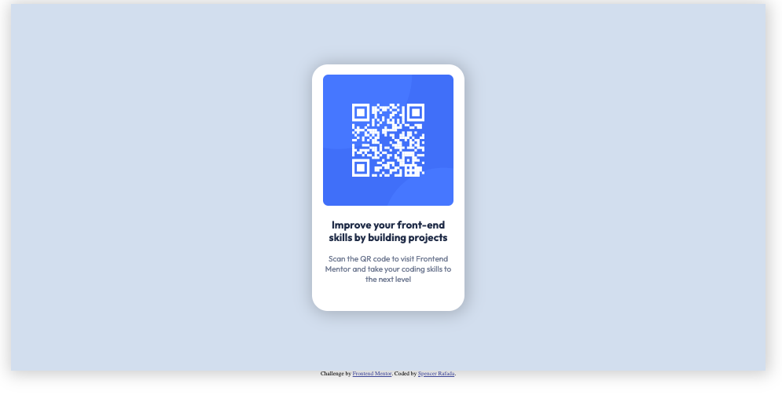

# Frontend Mentor - QR code component solution

This is a solution to the [QR code component challenge on Frontend Mentor](https://www.frontendmentor.io/challenges/qr-code-component-iux_sIO_H). Frontend Mentor challenges help you improve your coding skills by building realistic projects. 

## Table of contents

- [Overview](#overview)
  - [Screenshot](#screenshot)
  - [Links](#links)
- [My process](#my-process)
  - [Built with](#built-with)
  - [What I learned](#what-i-learned)
  - [Continued development](#continued-development)
  - [Useful resources](#useful-resources)
- [Author](#author)
- [Acknowledgments](#acknowledgments)

**Note: Delete this note and update the table of contents based on what sections you keep.**

## Overview

### Screenshot

### Links

- Solution URL: [My Solution](https://github.com/spencer-rafada/frontendmentor-challenges/tree/master/qr-code-component-main)
- Live Site URL: [My Live Site URL](https://spencer-rafada.github.io/frontendmentor-challenges/qr-code-component-main/)

## My process

First, I set up index.html to add all of the contents that I am missing. After doing so, I set up the css files with all of the color pallettes and fonts that are used. I added class names to the html elements to make it easier for me to add styles onto them. After doing so, I troubleshoot with the developer tools in the browser and inspect what was going on each html element.
### Built with

- HTML
- CSS

### What I learned

I learned how to troubleshoot using the debugger tools. I also learned how to solve the problem by asking or searching the right questions in Google. I want to improve on my front end skills so I did my best to what I am capable of then search or ask when I got stuck.

### Continued development

I want to improve on my ability to tell which css properties are being used from a glance. I also want to improve on getting better with manipulating css properties of nonsemantic html elements.

### Useful resources

- [@media rule](https://www.w3schools.com/cssref/css3_pr_mediaquery.php) - This helped me learn how to create the design interactive based from the user device.
- [hsl](https://developer.mozilla.org/en-US/docs/Web/CSS/color_value/hsl) - This page helped me learn how to use hsl value of color instead of rgb.

## Author

- Website - [Spencer Rafada](https://github.com/spencer-rafada)
- Frontend Mentor - [@spencer-rafada](https://www.frontendmentor.io/profile/spencer-rafada)
- LinkedIn - [N. Spencer Rafada](https://www.linkedin.com/in/spencer-rafada/)

## Acknowledgments

I acknowledge my fiancee, Hana Ko, for continuing to support me and being patient with my stress as I further my knowledge in Software Development.